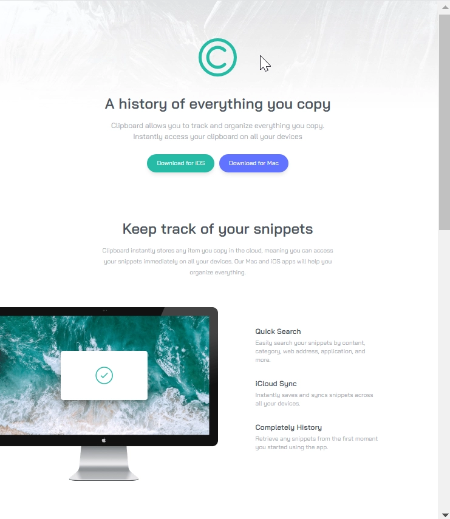

### 👋 **I am Erhan ERTEM**

&emsp;

## Udemy Tailwind CSS From Scratch Learn By Building Projects Brad Traversy

### **Objective:** Clipboard Website

&emsp;

#### Link to Project &rarr; [Clipboard Website](https://clipboard-erhan-ertem.netlify.app/)

---

 

Installed NPM packages and utilized APIs:

| Package command                      | Package link               | Description                      |
| ------------------------------------ | -------------------------- | -------------------------------- |
| npm i -D tailwindcss                 | <https://tailwindcss.com/> | CSS preprocessor                 |
| npm i -D prettier-plugin-tailwindcss |                            | Prettier support for tailwindcss |

&emsp;
